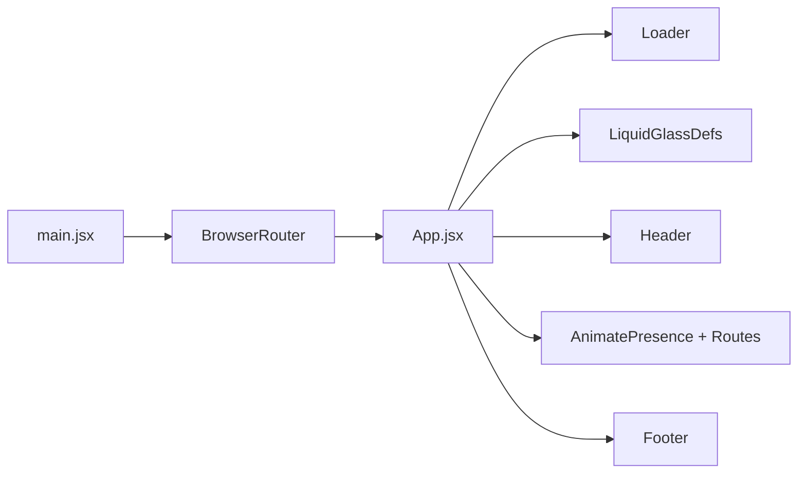
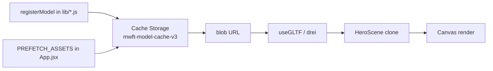

# Architecture

A high-level overview of how the MW Futuretech site is organized and how data flows through it.

---

## 1. Tech Stack Summary

| Concern            | Technology                                            |
| ------------------ | ----------------------------------------------------- |
| UI framework       | React 19 + JSX                                        |
| Build tool         | Vite 8                                                |
| Routing            | React Router v7 (`react-router-dom`)                  |
| 3D rendering       | Three.js + `@react-three/fiber` + `@react-three/drei` |
| Animation          | GSAP, Motion (`motion/react`), `lottie-react`         |
| Smooth scrolling   | Lenis                                                 |
| Globe              | `cobe`                                                |
| Icons              | `lucide-react`                                        |
| Styling            | Plain CSS + CSS variables + Tailwind + PostCSS        |
| Image optimization | Sharp (`scripts/optimize-images.mjs`)                 |
| Serverless API     | Vercel functions under `/api`                         |
| Hosting            | Vercel                                                |

---

## 2. Folder Layout

```
FutureTech/
├── api/                    # Vercel serverless functions
│   ├── ai-search.js        #   AI-powered site search
│   └── site-context.js     #   Searchable site content/context
├── public/                 # Static assets (served at site root "/")
│   ├── images/             #   Hero backgrounds, illustrations, media
│   ├── team/               #   Team member photos
│   ├── directors/          #   Director photos & cards
│   ├── footer/             #   Footer social / logo icons
│   ├── contact/            #   Contact page media
│   ├── mockup/             #   Work/mockup screenshots
│   ├── models/             #   Meshopt-compressed GLB 3D models
│   ├── sounds/             #   Audio assets
│   └── favicon.*, icons.svg
├── scripts/
│   └── optimize-images.mjs # WebP generation script
├── src/
│   ├── assets/             # Vite-bundled assets (imported in JS)
│   ├── components/         # Reusable React components (+ .css each)
│   ├── data/               # Static data (directors, expertise, team)
│   ├── hooks/              # Custom hooks
│   ├── lib/                # Model cache + per-model modules
│   ├── pages/              # Route-level page components
│   ├── styles/             # Shared styles (liquid-glass.css)
│   ├── App.jsx             # Root: routes, transitions, preloads
│   ├── App.css             # Global app styles
│   ├── index.css           # CSS variables + base reset
│   └── main.jsx            # Entry point (BrowserRouter)
├── .github/copilot-instructions.md  # Coding conventions (also a good spec)
├── vercel.json             # Vercel SPA rewrite rules
└── vite.config.js          # Vite config + API dev middleware
```

---

## 3. Boot Sequence



1. `src/main.jsx` mounts `<App />` inside `<BrowserRouter>`.
2. `App.jsx` applies the theme (`data-theme` on `<html>`), arms a Lenis smooth-scroll controller, and warms the image cache for hero backgrounds.
3. The **global** `<Loader />` plays until complete, then the routes render.
4. `<LiquidGlassDefs />` mounts the SVG displacement filter used by every liquid-glass surface.
5. `<Header />` / `<Footer />` frame the routed page content.

---

## 4. Routing & Page Transitions

- `App.jsx` owns the `<Routes>` block (lazy-loaded pages via `React.lazy` + `<Suspense>`).
- Routes are wrapped in `<AnimatePresence mode="wait">` for a cross-fade between pages.
- A route-switch overlay covers the screen during transitions (~1.2s). **This matters for 3D mount animations** — see [3D Model Pipeline](./3d-model-pipeline.md).
- `vercel.json` rewrites all paths to `index.html` so the SPA handles deep links.

Routes and their pages are documented in **[Routing & Pages](./routing-and-pages.md)**.

---

## 5. Data Flow for 3D Models



1. Each model has a cache module in `src/lib/` (e.g. `heroModel.js`).
2. `registerModel(url)` returns helpers (`promise`, `isReady()`, `getUrl()`) and warms Cache Storage on import.
3. Components consume the **blob URL** so drei parses the GLB exactly once.
4. Scenes **clone** the shared `useGLTF` scene per instance to prevent the route-switch overlay from stealing the parent.

See **[3D Model Pipeline](./3d-model-pipeline.md)** for the full walkthrough.

---

## 6. Key Files & Responsibilities

| File                                                 | Responsibility                                                      |
| ---------------------------------------------------- | ------------------------------------------------------------------- |
| `src/main.jsx`                                       | Entry point, mounts the router                                      |
| `src/App.jsx`                                        | Routes, page transitions, hero image preloads, loader orchestration |
| `src/index.css`                                      | CSS custom properties (theme tokens) + base reset                   |
| `src/App.css`                                        | Global app / layout styles                                          |
| `src/styles/liquid-glass.css`                        | The shared Liquid Glass design system                               |
| `src/components/LiquidGlassDefs.jsx`                 | SVG displacement filter for refraction                              |
| `src/components/HeroScene.jsx`                       | Shared 3D hero + `SILVER_MODEL_LIGHTING_PROPS`                      |
| `src/components/Loader.jsx` / `TransitionLoader.jsx` | Boot loader & route overlay                                         |
| `src/lib/modelCache.js`                              | Generic model cache + blob-URL helper                               |
| `src/hooks/*`                                        | Lenis, viewport compensation, zoom compensation                     |
| `vite.config.js`                                     | Vite config, vendor chunking, dev API proxy                         |
| `vercel.json`                                        | SPA rewrite rules for hosting                                       |

---

## 7. Styling Model

- **CSS custom properties** in `src/index.css` define theme tokens (colors, spacing, radii).
- Components pair a `.jsx` with a co-located `.css` file (e.g. `Header.jsx` + `Header.css`).
- **Liquid Glass** is the single shared UI-surface system (see [Styling & Theming](./styling-and-theming.md)).
- Many components also use **Tailwind utility classes** inline.

---

## Next Steps

- [Assets & Images](./assets-and-images.md) — where every image lives
- [3D Model Pipeline](./3d-model-pipeline.md) — adding a model end-to-end
